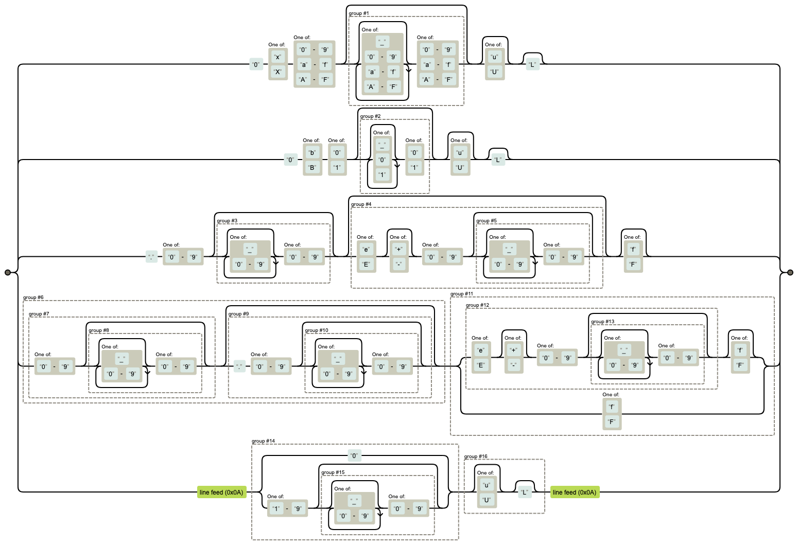

Recently I was investigating some bug in my branch of the Kotlin compiler and suddenly I had a hunch that my code probably was confused by some inlining. So to quickly verify that idea, my muscle memory rushed me to the already open tab of [*Compiler Explorer*](https://godbolt.org/).

So I pasted the code, Kotlin target already preselected from a long forgotten past experiment and – *Huh*, Compiler Explorer doesn't correctly highlight my code.

That's weird, the code is correct, the compiler ran, I see the bytecode that confirms that inlining takes place which will be a cause for many future headaches but at this point I don't care about that anymore. Why doesn't Godbolt correctly highlight `3uL`.

Well at least there is still the trusty [Kotlin Playground](https://play.kotlinlang.org/), let's paste it in there and voilá – _WHAT?_ Even that doesn't highlight the suffix?

Ok back to [IntelliJ IDEA](https://www.jetbrains.com/idea/), I **need** to see at least one colored number literal, and luckily the most common IDE for Kotlin does do it right.

## What's going on here?

It's safe to assume that Compiler Explorer with such a wide array of supported languages and a huge pile of other difficult problems to solve (like [92 million yearly compilations](https://xania.org/202506/how-compiler-explorer-works)) doesn't maintain it's own language parsing and code editing framework. So let's grab our trenchcoat and magifier glass and cosplay as the world's most famous detective.

_Right click -> Inspect -> Scroll -> Click -> Scroll_ ... and there we have the corprate, [*Manaco - The Editor of the Web*](https://microsoft.github.io/monaco-editor/). 
A quick google search later and on the Monaco Playground we can verify that indeed the bug seems to originate from here.

Glancing over the [ReadMe](https://github.com/microsoft/monaco-editor?tab=readme-ov-file#faq) we find the following interesting section:

> The Monaco Editor is generated straight from VS Code's sources with some [...]

_Wait_ does that mean, that the bug actually originates from VS Code?

Well, no. While the Monaco Core does call the VSCode repo it's home, it doesn't contain the highlighting code, so the bug is isolated to Monaco. This also means that while Monaco is able to highlight Kotlin, vanilla VSCode without plugins isn't.

Going though a similar investigation sprint for Kotlin Playground we find that 
here too, they depend on an open source solution, but in this case it's [*CodeMirror*](https://codemirror.net/).

## A quick deep dive into Kotlin's number literals

> Chirpy the parrot: So what's so hard about Kotlin literals

Well, nothing here is inherently *hard*, many other languages, like Java have a similar level of complexity, but to my knowledge it does have some _oddeties_ I haven't seen in many languages.

But let's start at the beginning, there are 4 ways to write a number literal:

```kotlin
val float = 1.23
val dec = 123
val hex = 0xff80
val bin = 0b101010
```

As you can see like C and Java it has floating point and binary and hex notations, with the later two requiring a prefix (the casing doesn't matter and so `0Xff80` would also be fine here.)

For floats the only allowed suffix is `f`. By default all numbers are doubles and if you need to force a reduced width you can add this, but often you don't have to care about this since type-inference can figure it out for you.

```kotlin
val strudel = 1.23      // this is actually a double
val kuchen  = 1.23f     // this is a float
val melange = 123f      // Also a float
```

Since float literals are doubles by default there is no need for, and no way to, express double literals with a suffix.

For decimal, hexadecimal and binary literals you can also add the suffix `u` or `U` to make them unsigned (a somewhat newer feature introduced in Kotlin 1.5, May 2021) and `L` to make them long. Note here that the lower case `l` isn't allowed.

```kotlin
val a = 123u        // Unsinged Int
val b = 123U        // Unsigned Int
val c = 123L        // Long
val d = 123uL       // Unsigned Long
val e = 123UL       // Unsigned Long

val fixned = 123l   // Error: Use 'L' instead of 'l'.
```

> Chirpy the parrot: This code doesn't look quite right. Why is it so colorless?

Well well well, guess who relied on an open-source solution for his blog's code highlighting?

Since Kotlin 1.1 you can also use underscores inside nunbers to seperate them (but they must appear in the middle):

```kotlin
val million = 1_000_000
val red = 0xFF_00_00
val twoBytes = 0b01100101_11010101
```

It's also important to mention that leading zero's aren't allowed for decimal
literals.

```kotlin
// These are ok
val zero = 0      
val floatingZero = 0.0
val floatSuffix = 0000f
val longZero = 0L
val binary = 0b000
val hex = 0x000

// These aren't
val twoZeros = 00     
val may = 05
```

We're almost done but it is important to mention that floating points can also directly start with a dot or can contain the _E Noation_.

```kotlin
val x = .123
val 1.2e+3
```

I know this whole paragraph wasn't quite the formal notation you might be used to, so if you're the kind reasonable workaholic who reads EBNF grammar in their free time you can also dive in to the Kotlin Specification that has that.

Or if for some sick reason you prefer a massive regex:

```text
0[xX][0-9a-fA-F]([_0-9a-fA-F]*[0-9a-fA-F])?[uU]?L?|
0[bB][01]([_01]*[01])?[uU]?L?|
\.[0-9]([_0-9]*[0-9])?([eE][+-]?[0-9]([_0-9]*[0-9])?)?[fF]?|
(([0-9]([_0-9]*[0-9])?)(\.[0-9]([_0-9]*[0-9])?)?)(([eE][+-]?[0-9]([_0-9]*[0-9])?)[fF]?|[fF])|
(0|[1-9]([_0-9]*[0-9])?)([uU]?L?)
```



_Yikes!_

You can say a lot good things about Regex but it won't win any prices for readability. Luckily, I wrote that one by hand for _Other Reasons™_ (aka. foreshadowing) so stick with the grammar if you need to be sure.

## Bad highlighting all the way down

Ok so we investigated two out of two open source soultions and they get Kotlin's
number literals wrong. That seems pretty unlikely, what are the odds of that?

So from the rules above I patched together a simple file with a handful of test cases and pasted it into any highlighting library I could get my hands on. Which in the end allowed me to produce this little gallery of bad highlights.

_TODO_

- CodeMirror
- Monaco
- highlight.js
- prism.js
- rainbow.js
- pygments
- rouge (is good)
- treesiter

## All numbers have the literal right to be highlighted

And here we are right now, we found a tiny whole in almost all highlighting software (including the one that runs this blog) and a whole weekend at hand. I guess it's time to get our hands dirty and contribute back.

<!--
As a good open-source loving person that used most many of the libraries mentioned above (directly or indirectly) there is really only thing to do: **Fixing the problem**.
-->

Till now I used to play around to with each highlighter until I find a problem, but if we are going to fix them it would be really useful to have a test-set. Obviously, I could also always dig into the codebase and compare that to the mental model I have, but having an exhaustive test-set to copy and paste isn't just less error-prone but also much quicker to validate. So I took the original grammar from the spec and instead of using it to create a parser I wrote a [generator for valid literals](https://gist.github.com/flofriday/1ff27a1324a3fa92c5a614e46b43dd37).

With a few utility functions that map closely to EBNF grammar the Kotlin code looked remarkably similar to the the grammar, making it easy to verify the correctness.

```kotlin
/**
 * Grammar:
 * [DecDigits] '.' DecDigits [DoubleExponent]
 * | DecDigits DoubleExponent
 */
fun doubleLiteral(): List<String> =
    either(
        optional(decDigits())
            .add(".")
            .add(decDigits())
            .optional(doubleExponent()),
        decDigits().add(doubleExponent())
    )
```

With my cute 3k lines of testcases (I might have overdone it just a little) it was quite easy to quickly get a rough overview _if_ and _where_ the issues in a highlighter might be. From there it was mostly a task of grepping through the codebase for any mention of Kotlin finding the code responsible and adjusting it as needed.

While I already had a complete regex for a correct parsing and most libraries do use regex for lexing (which is a totally valid for lexing) I didn't just paste it in there. Some project had only a quite simplistic approach and there it made sense to replace the little they had with a more sophisticated one, but others did only lack some corner cases so there I tried the least invasive approach and only changed where it was necessary.

_A note on progressive parsing_

Here is a list of PRs I made that I will keep updating as I add more fixes:

- [CodeMirror](https://github.com/codemirror/legacy-modes/pull/23)
- [highlight.js](https://github.com/highlightjs/highlight.js/pull/4307)

A notable mention in all of this is [Rouge](https://rouge.jneen.net/) a highlighting library for Ruby that did handle everything I threw at it and has an implementation that is remarkably close to the official Kotlin grammar.

## Remarks

While this post mostly highlights issues (pun intended) in open source libraries it's not my intention to blame anyone here. Many of them do support a huge amount of languages and keeping up with syntax changes is impossible for what if often just a volunteer project of a single person.

Instead, I want to thank you, for making it so much easier communicate about code (especially for the ones with dyslexia).

<!-- I know this whole post could be negativly iterpreted as _open source sucks_ because I only highlighted (pun intended) issues in various different implementations. 
 -->

I want to take this space of unused internet realestate to thank my friends for the alternative titles they suggested. They made me laugh pretty hard so you might enjoy them too:

- 50 Shades of Kotlin: Your Code is missing color
- From 0L to Hero: Fixing Kotlin number highlighters
- All Number literals have a right to be highlighted
- Number literal(ly) broken: What syntax highlighters get wrong
- Fixing Kotlin number highlighters with this one simple trick; Developers are shocked!