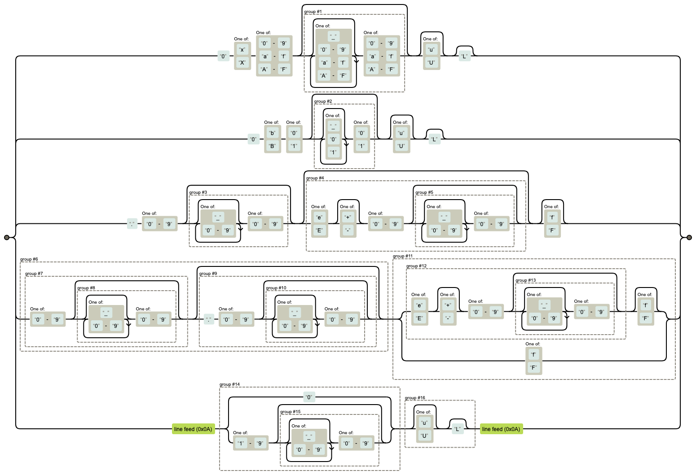
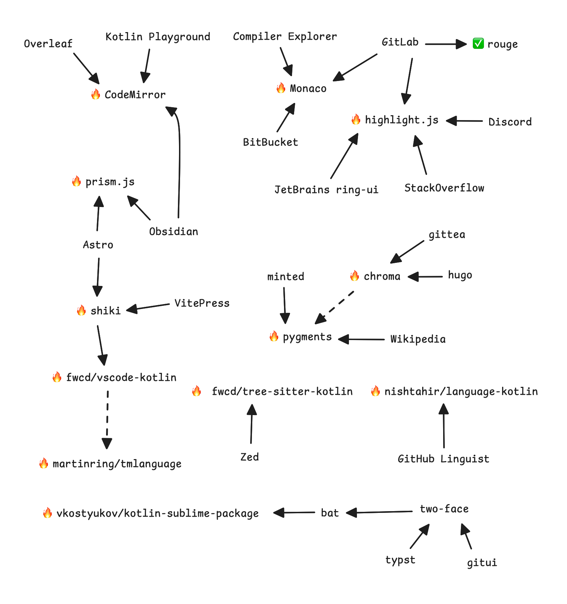

Recently I was investigating some bug in my branch of the Kotlin compiler and suddenly I had a hunch that my code probably was confused by some inlining. So to quickly verify that idea, my muscle memory rushed me to the already open tab of [*Compiler Explorer*](https://godbolt.org/).

> **🦜 Chirpy the Parrot:** Compiler Explorer (formerly Godbolt) is a tool that let's you try out different compilers and inspect the assembly, JVM Bytecode etc that they produce.

So I pasted the code, Kotlin target already preselected from a long forgotten past experiment and – *Huh*, Compiler Explorer doesn't correctly highlight my code.

That's weird, the code is correct, the compiler ran, I see the bytecode that confirms that inlining takes place which will be a cause for many future headaches but I already don't care about that anymore. Why doesn't Compiler Explorer correctly highlight `3uL`?

Well at least there is still the trusty [Kotlin Playground](https://play.kotlinlang.org/), let's paste it in there and voilà – _WHAT?_ Even that doesn't highlight the suffix?

Ok back to [IntelliJ IDEA](https://www.jetbrains.com/idea/), I **need** to see at least one colored number literal, and luckily the most common IDE for Kotlin does do it right.

## What's going on here?

It's safe to assume that Compiler Explorer with such a wide array of supported languages and a huge pile of other difficult problems to solve (like [92 million yearly compilations](https://xania.org/202506/how-compiler-explorer-works)) doesn't maintain it's own language parsing and code editing framework. So let's grab our trenchcoat and magnifier glass and cosplay as the world's most famous detective.

_Right click -> Inspect -> Scroll -> Click -> Scroll_ ... and there we have the culprit, [*Manaco - The Editor of the Web*](https://microsoft.github.io/monaco-editor/).
A quick google search later and on the Monaco Playground we can verify that indeed the bug seems to originate from here.

Glancing over the [ReadMe](https://github.com/microsoft/monaco-editor?tab=readme-ov-file#faq) we find the following interesting section:

> The Monaco Editor is generated straight from VS Code's sources with some [...]

_Wait_ does that mean, that the bug actually originates from VS Code?

Well ... no. While the Monaco Core does call the VSCode repo it's home, it doesn't contain the highlighting code, so the bug is isolated to Monaco. This also means that while Monaco is able to highlight Kotlin, vanilla VSCode without plugins isn't.

Going though a similar investigation sprint for Kotlin Playground we find that
here too, they depend on an open source solution, but in this case it's [*CodeMirror*](https://codemirror.net/).

## A quick deep dive into Kotlin's number literals

> **🦜 Chirpy the Parrot:** So what's so hard about Kotlin literals?

Well, nothing here is inherently *hard*, many other languages, like Java, have a similar level of complexity, but to my knowledge it does have some _oddeties_ I haven't seen in many languages.

But let's start at the beginning, there are 4 ways to write a number literal:

```kotlin
val float = 1.23
val dec = 123
val hex = 0xff80
val bin = 0b101010
```

As you can see like C and Java it has floating point and binary and hex notations, with the later two requiring a prefix (the casing doesn't matter and so `0Xff80` would also be fine here.)

For floats the only allowed suffix is `f`. By default all numbers are doubles and if you need to force a reduced width you can add this, but often you don't have to care about this since type-inference can figure it out for you.

```kotlin
val strudel = 1.23      // this is actually a double
val kuchen  = 1.23f     // this is a float
val melange = 123f      // Also a float
```

Since float literals are doubles by default there is no need for, and no way to, express double literals with a suffix.

For decimal, hexadecimal and binary literals you can also add the suffix `u` or `U` to make them unsigned (a somewhat newer feature introduced in Kotlin 1.5, May 2021) and `L` to make them long. Note here that the lower case `l` isn't allowed.

```kotlin
val a = 123u        // Unsinged Int
val b = 123U        // Unsigned Int
val c = 123L        // Long
val d = 123uL       // Unsigned Long
val e = 123UL       // Unsigned Long

val fixned = 123l   // Error: Use 'L' instead of 'l'.
```

> **🦜 Chirpy the Parrot:** This code doesn't look quite right. Why is it so ... _colorless_?

Well well well, guess who relied on an open-source solution for his blog's code highlighting?

Since Kotlin 1.1 you can also use underscores inside numbers to separate them (but they must appear in the middle):

```kotlin
val million = 1_000_000
val red = 0xFF_00_00
val twoBytes = 0b01100101_11010101
val longSpace = 1__3
```

It's also important to mention that leading zero's aren't allowed for decimal
literals.

```kotlin
// These are ok
val zero = 0
val floatingZero = 0.0
val floatSuffix = 0000f
val longZero = 0L
val binary = 0b000
val hex = 0x000

// These aren't
val twoZeros = 00
val may = 05
```

We're almost done, but floating points can also directly start with a dot or can contain the _E Notation_.

```kotlin
val x = .123
val 1.2e+3
```

I know this whole paragraph wasn't quite the formal notation you might be used to, so if you're the kind reasonable workaholic who reads EBNF grammar in their free time you can also dive in to the [Kotlin Specification](https://kotlinlang.org/spec/pdf/kotlin-spec.pdf) (section 1.2.3 Literals) that has that.

Or if for some sick reason you prefer a massive regex:

```text
0[xX][0-9a-fA-F]([_0-9a-fA-F]*[0-9a-fA-F])?[uU]?L?|
0[bB][01]([_01]*[01])?[uU]?L?|
\.[0-9]([_0-9]*[0-9])?([eE][+-]?[0-9]([_0-9]*[0-9])?)?[fF]?|
(([0-9]([_0-9]*[0-9])?)(\.[0-9]([_0-9]*[0-9])?)?)(([eE][+-]?[0-9]([_0-9]*[0-9])?)[fF]?|[fF])|
(0|[1-9]([_0-9]*[0-9])?)([uU]?L?)
```



_Yikes!_

You can say a lot good things about Regex but it won't win any prices for readability. Luckily, I wrote that one for _Other Reasons™_ (aka. foreshadowing) so stick with the grammar if you need to be sure.

## Bad highlighting all the way down

Ok so we investigated two out of two open source solutions and they get Kotlin's
number literals wrong. That seems pretty unlikely. _What are the odds of that?_

So far I stumbled across the higlighting problem by accident, but to see if it's a broader problem it would be much easier to to have an test file we can past into each. Obviously, I could also always dig into the codebase and compare that to the mental model I have in my head, but having an exhaustive test-set to copy and paste isn't just less error-prone but also much quicker to validate. So I took the original grammar from the spec and instead of using it to create a parser I wrote a [generator for valid literals](https://gist.github.com/flofriday/1ff27a1324a3fa92c5a614e46b43dd37).

After manifesting some utility functions into existence, the generator code ended up looking remarkably similar to the EBNF grammar it implemented, making it easy to verify for correctness. As a side note I'm a big fan of copying the spec into sourcecode.

```kotlin
/**
 * Grammar:
 * [DecDigits] '.' DecDigits [DoubleExponent]
 * | DecDigits DoubleExponent
 */
fun doubleLiteral(): List<String> =
    either(
        optional(decDigits())
            .add(".")
            .add(decDigits())
            .optional(doubleExponent()),
        decDigits()
            .add(doubleExponent())
    )
```

With my cute 3k lines of testcases (I might have overdone it just a little) it was quite easy to quickly get a rough overview _if_ and _where_ the issues in a highlighter might be.

As a next reasonable step I went on a fever-dream like rampage pasting that snippet into any code editor and highlighter library demo page I could think of. 

Actually, this reminds me of another point, if you ever find yourself maintaining a highlighter 1) Congratulation 2) good luck with rejecting a never-ending stream of unsolicited PRs for languages with a single digit userbase, even when represented in binary format and 3) please let me try your library in the browser. With the current state of WASM and basically free hosting with GitHub pages there is almost no excuses not to. I know that it might be impractically slow and the bundle might be too large for production-use but when I'm _shopping_ for a highlighter my first priority is it's quality and an interactive demo lets me figure that out so much faster.

After the initial high of pasting that code into everything I could think of, I walked away with two realizations. First, almost every highlighter struggles with Kotlin's numbers. And second, while there are a lot of editors, libraries, tools and websites that do highlighting, there aren't _that_ many sources that reimplement a parser for Kotlin.

The more obvious examples are Discord or StackOverflow that both rely on a library to do the highlighting (in that case highlight.js). But then there are some libraries that ingest a textmate grammar or treesitter grammar. Or the one golang library _chroma_ that has a tool that can parse python code from _pygments_ to generate grammar definition in a custom XML file format (kinda crazy but I love it).

So to get a overview how all of this relates to each other I crafted that following graph of popular libraries and some of my favorite tools:



## All numbers have the literal right to be highlighted

I know overall this is somewhat of a minor problem, the notations are somewhat rare and even without correct highlighting you can still read the code and get the point. However, I do think of it as a first line of defense against bad code. I actually vividly remember the first time I started coding and being pleasantly surprised how _friendly_ the code editor looked with all it's colors. Especially as a beginner when you're unsure with every keystroke you type, it makes such a difference when the correct keywords light up in another color to tell you that you are on the right path.

> **🦜 Chirpy the Parrot:** So you found a minor systemic bug nobody really cares about, what ya gonnna do about it?

I guess it's time to get our hands dirty and write some code.

<!-- Monaco story continued -->
We need to start somewhere, so let's teach Monaco, and once the fixed version is published Compiler Explorer, how to correctly highlight numbers. Luckily it is hosted on GitHub, which makes sense since both are Microsoft products, though screenshot of the outdated Firefox in the README makes me chuckle a bit. But this means we can use the search for any reference of Kotlin in the repo, before we even decide to clone it.

The search reveals a couple of files, where `src/basic-languages/kotlin/kotlin.ts` looks the most promising and after we scroll through the contents that look suspiciously like a custom grammar format for a parser, we find the following lines.

```typescript
// numbers
[/(@digits)[eE]([\-+]?(@digits))?[fFdD]?/, 'number.float'],
[/(@digits)\.(@digits)([eE][\-+]?(@digits))?[fFdD]?/, 'number.float'],
[/0[xX](@hexdigits)[Ll]?/, 'number.hex'],
[/0(@octaldigits)[Ll]?/, 'number.octal'],
[/0[bB](@binarydigits)[Ll]?/, 'number.binary'],
[/(@digits)[fFdD]/, 'number.float'],
[/(@digits)[lL]?/, 'number'],
```

Even on a quick look we can find handling for number suffixes but no mention of a `u` but instead the forbidden lowercase `l` and `d` or `D` which Java uses for double literals.

The repo cloned and after some struggling a test setup, we can finally play with tweaking the regex until accepts all valid inputs. Setting up the development environment was a bit frustrating as the CLI command didn't mentioned didn't use the updated syntax files and so eventually I gave up and opened the repository in VSCode where the launch config worked on the first try (but why did it open the tool in Chrome, when Firefox is my default browser).

While we already have a regex that we can apply for correct lexing and most highlighters use regex for this part, it isn't as easy as just pasting that in an opening a PR. To help out the maintainers reviewing the changes it makes much more sense to see what's already there and if only a single edge-case is missing we'll try to be the good surgon we always knew we could be and only do least invasive procedure necessary.

And then there are the cases where don't want to be _correct_ on purpose. This especially applies to editors where you might want to allow incomplete literals so when the user types it is already highlighted as it might _feel_ slow when the editor only catches up once you are done typing.

```kotlin
// Correct literals
val full = 1_2
val octal = 0xf

// Incomplete literals,
// but we might already want to highlight them
val partial = 1_
val partialOct = 0x
```

So with the Koltin parser extended I also added some testcases to verify that everything keeps working correctly and opened my PR.

The process for other highlighters was quite similar so that we finally end up with a short list of completed PRs – that I'll now promise to keep updating but will most likely eventually forget:

- [Monaco](https://github.com/microsoft/monaco-editor/pull/4973)
- [CodeMirror](https://github.com/codemirror/legacy-modes/pull/23)
- [highlight.js](https://github.com/highlightjs/highlight.js/pull/4307)
- [Pygments](https://github.com/pygments/pygments/pull/2961)
- [Chroma](https://github.com/alecthomas/chroma/pull/1139)
- [fwcd/vscode-kotlin](https://github.com/fwcd/vscode-kotlin/pull/177) (most popular VSCode extension)

> **🦜 Chirpy the Parrot:** So what did they get wrong about Kotlin's number parsing?

Well, since Kotlin (especially in the beginning) was so closely related to Java, many projects either reused that parser directly or were heavily insipired by it. Quite often this lead to them accepting invalid code like the `d` and `D` suffixes.

Some syntax was only later introduced, like the `u` and `U` suffixes for unsinged numbers in Kotlin 1.5 and with some of the highlighters supporting about 200 languages changes like that can simply slip under the radar.

And sometimes your educated guesses can be wrong. All prefixes and suffixes are case insensitive except for the long suffix `L` where only the uppercase is valid.

Also parsing is hard, having implemented a couple of fixes, the same regex might work for one highlighter but fail in another as they use a different regex-engine that either has less features or is to greedy and doesn't backtrack far enough.

## Remarks

While this post mostly highlights issues (pun intended) in open source libraries it's not my intention to blame anyone here. I'm really glad they do exist and having looked into many of them and fixing some issues, I'm so gland someone has made the effort of to maintaining them which makes reading code so much easier (especially for those of us with dyslexia).

I want to take this space of unused internet realestate to thank my friends for the alternative titles they suggested. They made me laugh pretty hard so you might enjoy them too:

- 50 Shades of Kotlin: Your Code is missing color
- From 0L to Hero: Fixing Kotlin number highlighters
- All Number literals have a right to be highlighted
- Number literal(ly) broken: What syntax highlighters get wrong
- Fixing Kotlin number highlighters with this one simple trick; Developers are shocked!


🦋 [Comment on Bluesky](https://bsky.app/profile/flofriday.bsky.social/post/3lygdijv7m22u)