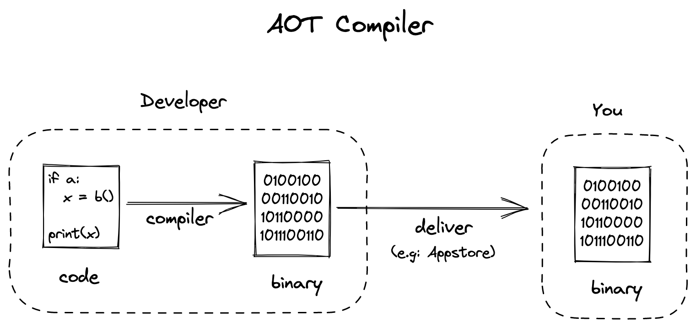
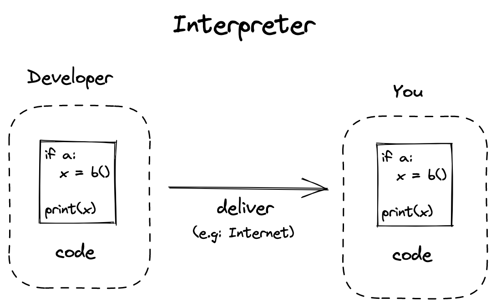
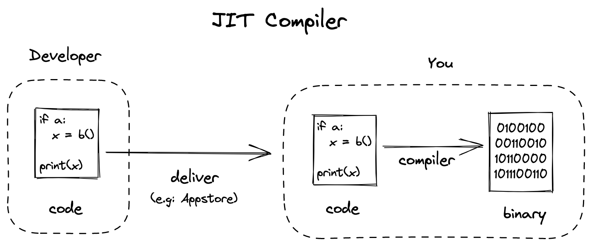

<!---->

My bachelor theses is in the field of just-in-time(JIT) compiler research and while
this already sounds very advanced (which I absolutely love) this is my attempt at
explaining it to a non technical audience.

## The _normal_ compiler

As you know from movies, computers can only understand binary (ones and zeros).
Contrary to most movies programmers and hackers don't program in binary and just
like you cannot read binary (well some can read basic binary, but it's still a lot slower
and I definitely can't).

So the solution is to write something in (english) text that is readable by humans and
then use a program to translate it to the binary machine code. The translation program
is what we call a compiler.

The classical compiler is a so called ahead-of-time (AoT) compiler, which means the
developer how writes the app also runs the compiler for your machine and then
sends you the compiled binary, which your computer just takes and runs.

## The Interpreter

Computers can be grouped into different Architectures where each architecture has a different set of instructions it understands. The most common architecture of Laptops and Desktops is x86 64bit and for Smartphones it is ARM 64bit.

So one disadvantage from Compilers is that for each Architecture and for each
Operating System you need to compile the Application. So if you want to have your
new app run on Linux, macOS and Windows for x86 and ARM you need to compile
your app 6 times.

One Solution here is to write your application in an language that is interpreted so that
the you can ship the user directly the source code which they then interpret.

However, this normally results in Applications that are a lot slower
(about 40-100 times). For many use cases this is acceptable but there is a solution for that.

> **Note:** The speed I reference here is pure computational. However there might be many other reasons an application _feels_ slow.

## The JIT compiler

To improve the performance you can compile (parts of) a program to machine code as you are about to run it. These compilers are called just-in-time (JIT) compilers. Like an interpreter you can just send the user the source code and don't have to compile it for each target. However, unlike an interpreter the application will be a lot faster.

JIT compiler are often integrated into Interpreters. The interpreter starts running a code and generates metrics about the code it runs. Once the interpreter finds a piece of the code that gets run often it will compile this piece with an JIT compiler to machine code which is a lot faster. These interpreters don't compile everything imediatly to machine code because the compilation itself also takes some time and for code that isn't executed often it is faster to just interpret it than to compile it to fast machine code.

## Conclusion

I have simplified many concepts here, and I am also not an expert in the field.
So it is quite possible that I have missed something important or that I got some
thing wrong, so please feel free to create an issue if that's the case.
