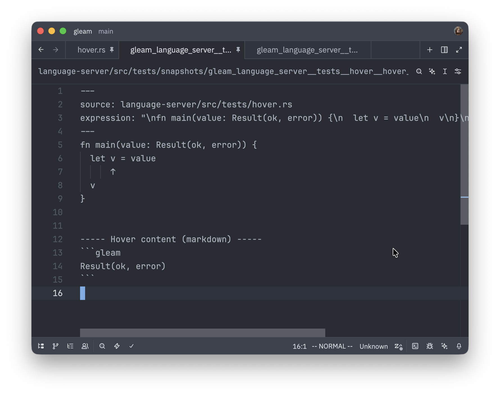
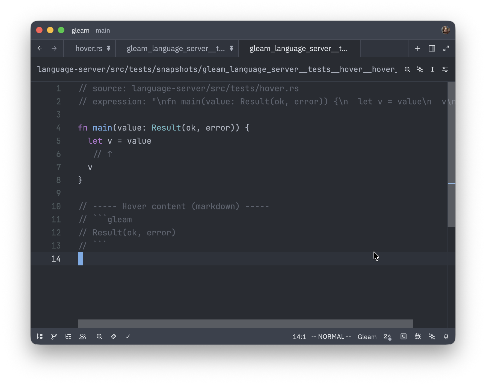
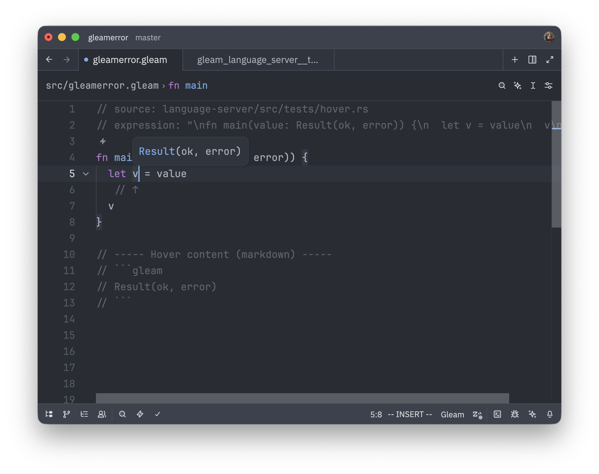
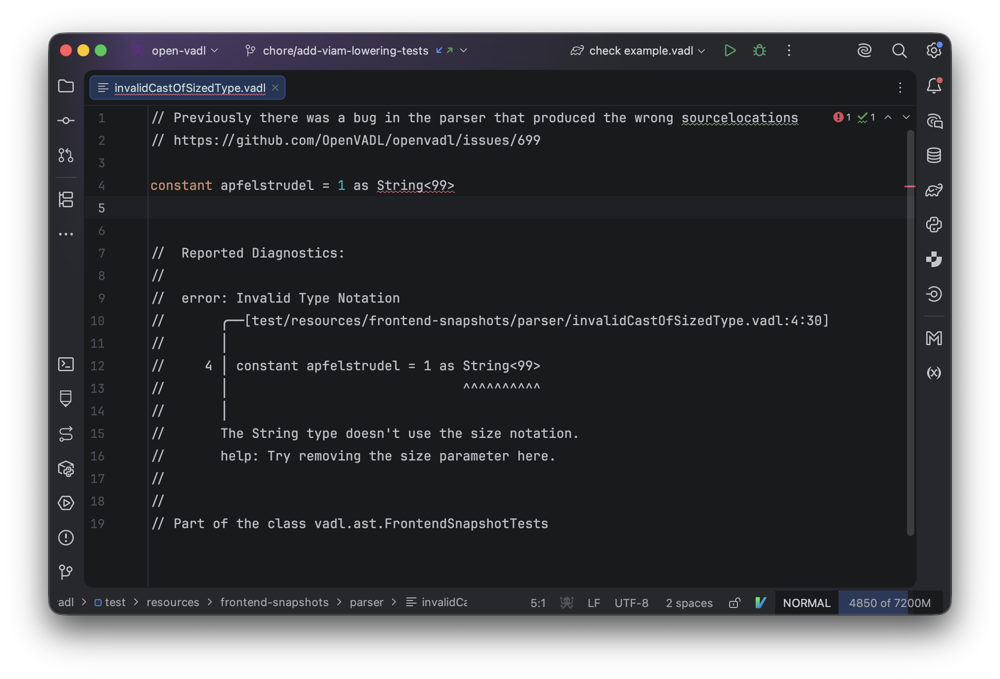
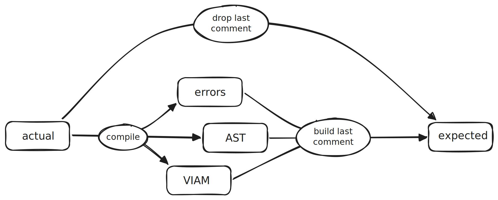
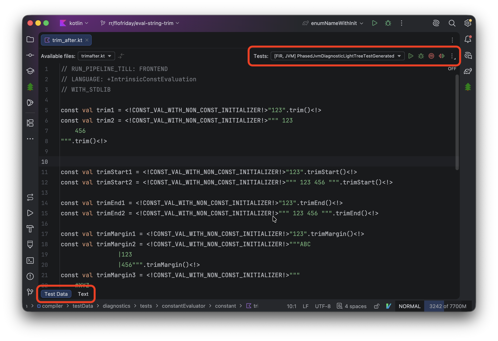
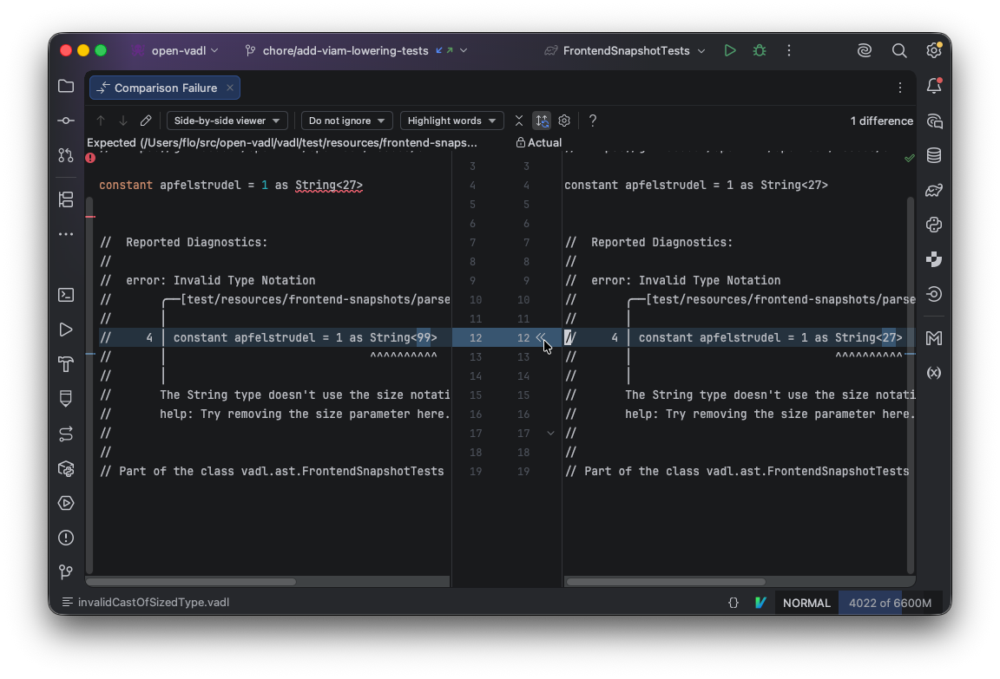
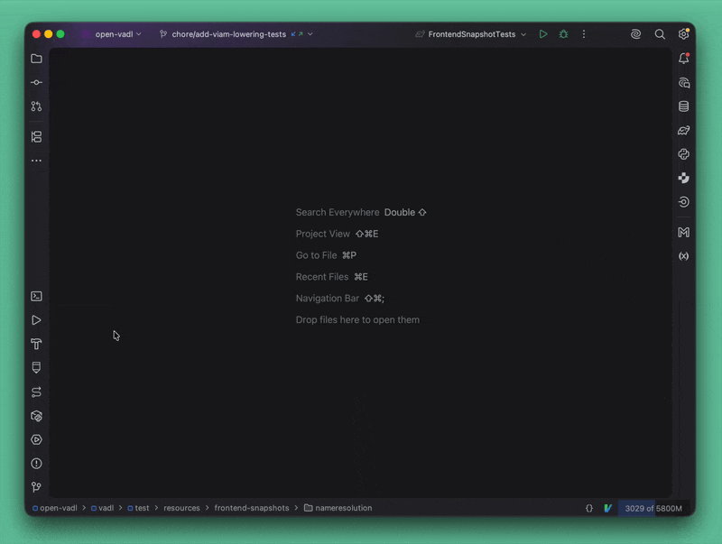

<!-- NOTES: Add social image -->

This post is mostly a response to Giacomo's amazing article [_Testing can be fun, actually_](https://giacomocavalieri.me/writing/testing-can-be-fun-actually) on snapshot testing. 

Over the last couple of months I also added snapshot testing to a couple of my projects and I'm beyond happy with the change. Not only that, but I've also noticed my behavior changing and that I intuitively added more test cases, since the burden to do so is a lot lower now. Actually my journey to snapshot testing only started _because_ I saw a talk from Giacomo, so thanks again.

All of this to say the post is amazing, go read it if you haven't yet but maybe we can improve upon this, especially for compiler tests, because...

## Code isn't just like any other text

One of the examples Giacomo uses is a test for Gleam's LSP and inside the Gleam compiler there are also many testcases for errors that use snapshot testing.

This is how such a test looks like for the gleam compiler. To be fair it's pretty readable but the thing that keeps bothering me is that there is no syntax highlighting and that the very LSP in my IDE doesn't recognize this file as Gleam.
And even if I force my editor to interpret the file as Gleam it won't work perfectly because the additional frontmatter at the top and the diagnostic output at the bottom doesn't make it valid gleam syntax. 

The good thing though is that nothing here is set in stone and so if we modify the snapshot framework a bit the snapshot could look like:

I really like this format, the code looks and feels like code, the whole 
snapshot is a valid file that the compiler can understand and since we also
renamed the file from `.snap` to `.gleam` suffix we also get syntax
higlighting for free. Even better since this test tests the LSP, we can 
even quickly verify the test in our editor by simply hovering over the mentioned
variable.

... well I kinda lied to you here, I couldn't actually get this to work with 
Gleam because the LSP wouldn't trigger in the snapshot file. I _assume_ this is
because Gleam doesn't do loose files and all files must be handled in the
context of a project and otherwise the LSP won't handle them as well.

But if your LSP can handle loose files this can be nice bonus.

A couple of months ago when I designed the snapshot tests for [OpenVADL](https://github.com/OpenVADL/openvadl) 
(the compiler I currently spend most my time with) I choose exactly this format 
and so far we're beyond happy with it. 

Since our LSP is still quite young and doesn't have any hover support yet, I 
cannot show you the same test for OpenVADL, but we do have quite a few tests
for compiler errors:

Working with these is just a bliss, the editor already adds squiggly lines to
the expression causing an error and again you can quickly verify the reported
error by hovering over the section.

Many of the tests only verify which errors are thrown and or if a successful compilation is possible, but they can also include AST dumps or VIAM (our custom IR) dumps.

Honestly, that's the gist of what I wanted to say, everything that follows is 
much less of a suggestion and more of a this is how we do testing in OpenVADL
right now and is fun right now but might come back to bite us in the ass later.

## Taking it even further - one test one file

Let's take another look at the OpenVADL example above, as you can see it already
contains the whole input we want to test. So instead of the file just being the
snapshot content that we verify against it actually is the whole test. There is
then also the `FrontendSnapshotTest` class that loads all files in a specified 
folder and executes them. 

While the [actual implementation](https://github.com/OpenVADL/openvadl/blob/732888d6e92ff29ba51f7d391eeff12983e04955/vadl/test/vadl/ast/FrontendSnapshotTests.java#L55) of this parameterized test is too large to
mention here, it basically does the following:

This makes adding new tests as hard as copy-pasting a file into the correct
folder.

To add a special dump (like AST or IR) to the snapshot the test only have to include a special comment like `// INCLUDE-AST-DUMP`.

Unfortunately, this has one drawback, for which I don't have any clean solution,
in that you cannot easily run just a single snapshot test, but you have to
run the whole suite (unless you want to spend minutes figuring out the right
gradle test command).

At the time of writing the whole 170 testsuite takes ~450ms on my machine so
running them all, isn't really that much of a slow down but it might become one 
in the future.

The Kotlin repository also has many snapshots tests, which do take a lot 
longer to run, so to easily run a single test, they don't simply load all the 
files dynamically in a folder but instead have a generator script that generates
testsuites (Kotlin code) where each test method handles on of the files. Adding new tests now 
also requires you to generate the tests, and even as you get used
to it, it adds just a bit more friction (in CI there is a check that verifies that you 
never actually forgot to run the script before you merge).

But normally you don't even use these generated tests directly, instead there is
a [custom IntelliJ Kotlin Development plugin](https://plugins.jetbrains.com/plugin/27616-kotlin-compiler-devkit) that automatically detects if you have such a snapshot
test open and injects a custom UI to run the test.

So far, investing that much into custom tooling wasn't necessary yet for 
OpenVADL but I think in the future building such a plugin is a real option.

## A bit of IDE Magic 

One of the big advantages of snapshot tests is that they easily adapt to changes
in the output. The most common case for us is when adding a new tests for the
first time, the generated comment at the end probably won't be in the file you 
dropped into the test folder.

But by throwing a very specific exception (`org.opentest4j.AssertionFailedError`) in [our test suite](https://github.com/OpenVADL/openvadl/blob/732888d6e92ff29ba51f7d391eeff12983e04955/vadl/test/vadl/TestUtils.java#L123-L135)
we do get help from IntelliJ, with a diff viewer 
(that's not _that_ special) where you can accept the changes into the snapshot
(_this_ is).

For example if in the previous OpenVADL snapshot we change `String<99>` to 
`String<27>` we get:

With a single mouse click we can accept the changes and we can move on to the 
next task.

I only discovered this behavior because I saw them first in a Kotlin test and 
was immediately flashed by it, which then lead me down the road to reversing 
those tests and recreating the behavior for OpenVADL.

So unfortunately, if you don't use a JVM language I don't have a good tip for
you how to recreate this, but I'm sure that this can also be recreated in 
JetBrains's other IDEs.

## Adding a new test

While writing this post I found out that we don't have a test to call a function
with a typo yet. So there cannot be a better opportunity to showcase the breeze 
that is adding a new test.

