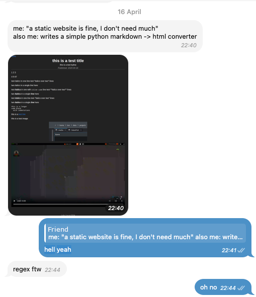

<!-- Start writing your markdown here ;) -->

## Getting nerd-sniped
A couple of weeks back a friend of mine asked me how my blog works and once I
told him that I wrote a custom (very simple) static site generator, he got
excited and started to build his own. 

> **🦜 Chirpy the Parrot:** Couldn't you just use an existing solution like substack or bearblog?

Of course, and that's also what I told him, however as developers we love to 
build stuff and it's not always about getting the easiest solution but about 
the fun of building stuff.

Anyway, a couple of days later I got a message which as a compiler engineer
scared me:



Well, there was only one obvious next step: Building a propper markdown parser 
and recording my-self doing so that he can learn more about parsers 😝.

## Why not regex?

If you don't spend all day thinking about grammars, LL(1)-conflicts and the 
advantages of right-recursion over left-recursion you might be wondering why 
I was so terrified by the attempt to parse markdown with regex.

The simple answer is that regular expression can only express regular languages 
but most languages like Markdown are context-free.

I think about it in the terms that while regex can count it cannot remember previous
counters. For example the following regex can accept one to five opening 
parenthesis and one to five closing ones. 

```regex
\({1-5}\){1-5}
```

However, it doesn't enforce that all openings ones have a closing one and there
is no way to express that in regex.

<!-- FIXME: I want code blocks in quotes -->

> **🦜 Chirpy the Parrot:** actually you can express it with: `\((\((\((\((\(()?\))?\))?\))?\))?\)`

Yes, Chirpy you are correct, as long as all counts are finite we can express it 
with a hideous regular grammar, however we often don't want to limit us to an upper 
limit. Also even if Markdown would enforce upper limits, I would argue that it
easier to write a recursive decent parser than such regex.

## Parsing markdown is ~~hard~~ _different_

So, I fired up VSCode and OBS and started writing a simple recursive decent 
parser. While there is no official Markdown spec the most common is 
[CommonMark](https://commonmark.org/), since I am more comfortable with GitHub 
flavored markdown, I implemented something along those lines. The goal is
to learn more about parsers anyway.

Pretty soon I discovered a pretty big difference between parsing Markdown and
other programming languages with which I had more experience: **there are no 
errors in Markdown**.

This means if you come across a _malformed_ rule you just decide to interpret it 
as something else. For example if the bold start `**` is never closed than we
just interpret it as text and not as formatting.

Unfortunately, this leads to quite some ugly code where we cannot insert a 
FormattingNode into our tree until we also found a matching closing tag, and 
otherwise need to insert the opening tag as text.

```python
def _parse_strikethrough(self: Self) -> list[Node]:
    self._inside_strikethrough = True
    children = self._parse_rich_text()
    self._inside_strikethrough = False

    if not self._match("~~"):
        return [TextNode("~~")] + children

    return [StrikeThroughNode(children)]
```


## Introducing meltdowns cousin: markberg

## Porting my blog to meltdown
<!-- Building it -->