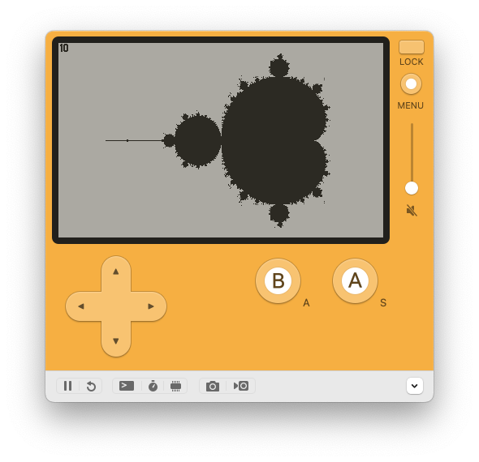
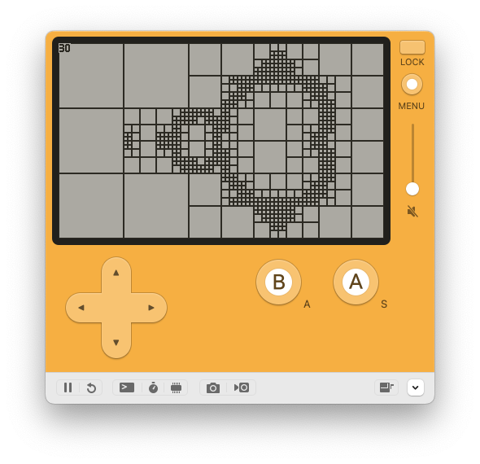

<!-- Start writing your markdown here ;) -->

One of the joys in my life is writing Mandelbrot renderers on platforms or languages that weren't designed for it. So as my playdate arrived last week I knew it was only a matter of time till it would display the fractal. 

The Playdate is low powered handheld game console with a 400x240 monochrome pixel display and comes with a Lua and C SDK. While most games are written in Lua the C bindings are quite handy to squeeze out every drop of performance.

To develop for the playdate the SDK also comes with a Simulator which usually runs a lot faster but at least for Lua Code the performance can be throttled to simulate the real hardware.

## Some base rules

Before we jump down the optimization rabbit whole, here are some things that never changed. The set is always rendered at the playdates native resolution and it always uses 64 iterations to determine if a pixel is part of the set.

## The unoptimized approach

Sure the playdate might be low powered but before digging into obscure optimizations I wanted to get a baseline and wrote a naive Mandelbrot renderer in Lua. Which displays this:

 
After 8.7 seconds. In the Simulator. Without throttling performance.

So yeah some optimizations will be needed, but just to be curious how long does it take on the real hardware?


Yeah, that doesn't look too good, but hey at least we only need to get a 263x speedup to get a smooth 30 frames per second in the simulator. So yeah the naive approach even failed at getting a baseline on real hardware so for we can only compare the simulator performance.

Before we jump now straight into C it might be useful to inspect the code and see if Lua can perform better. Since Lua doesn't have a complex number type like C I created my own which looks looks like this:

```lua
function createComplex(re, im)
    local complex = {
        re = re,
        im = im,

        square = function(self)
            local reSquared = self.re * self.re
            local imSquared = self.im * self.im
            return createComplex(reSquared - imSquared, 2.0 * self.re * self.im)
        end,

        plus = function(self, other)
            return createComplex(self.re + other.re, self.im + other.im)
        end
    }
    return complex
end
```

So this creates a lot of tables (what would be dicts in Python or Hashmaps in Java), all of them are allocated on the heap and since even arithmetic operations return a new instance this is not as efficient as it could be. And in the Profiler we see that 30% is just spend in the square method with additionally 13% in the plus method. Which brings us to our first optimization idea.

## Lua without tables

So while the tables are a nice abstraction they are not needed and we can just inline all the logic into the function which makes the code a lot uglier.

But it is worth the hit in readability as the render now only only takes 380ms, **a 22x speedup**. With this change we now also can finally run the renderer on real hardware without crashing where it takes 8.1 seconds. So even with that optimization we still need about a 250x speedup to hit 30 frames per second but at least we have a baseline now.

Further profiling doesn't reveal anything interesting as the profiler only works on a function level and now all of our calculations happen in a single function. Also the official guide for optimizations doesn't mention anything that we could apply to our renderer.

## Rendering in C

Porting the Lua code from the previous step to C shortens the time to 600ms on the Playdate, a **13x speedup**. This means we are hitting comfortable the 30FPS in the Simulator and even on the hardware we no longer count the seconds per frame but the frames per second, which are just below two, but still.

Now here I got a little stuck, first I applied an optimization that exploits mathematics and only needs two multiplications instead of 5 per loop iteration but that only reduced the time by 100ms to 500ms.

Replacing the drawRect function (for some reason there is no drawPixel function in the C API but in the Lua API) with getting the frame-buffer and modifying it directly further shortened the time to 270ms.

I also tried to detect periods up to a length of 20, but this decreased performance back to 330m, even though it could detect periods. I assume this is because we are already doing quite few iterations (just 64) compared to other implementations and therefore even if we detect a period we don't save that much time but every time we don't detect a period we still have to calculate the checks.

In total I managed to reach a **30x speedup** over the Lua version. However three to four frames per second aren't that impressive and since this algorithms has no obvious bottlenecks we probably need to implement a more sophisticated one.

## Recursive Subdivision

Since the mandelbrot is a connected structure without any wholes, we can fill a rectangle once we know that all sides have the same color. So the algorithm tiles the screen into big squares, if all pixels on the border don't have the same color the square is tiled into 4 squares and the algorithm repeats itself.


This lowers the time to 120ms, a little bit over a 2x speedup. At first this was somewhat underwhelming but my first naive implementation of this algorithm can be improved. For example neighboring cells don't share a border which means that the border between them is two pixels wide and gets calculated twice. Even worse, a cell that subdivides discards all calculations that were made in the previous iteration and does them again.

After spending way more time than I would have liked optimizing the algorithm to share borders between cells and caching already the calculated results (I use the frame buffer as a cache here) I got it to about 86ms about 11FPS. In total this is a **3x speedup** over the naive C version.

At this point I should probably mention that while recursive subdivision works flawlessly in theory, it produces some graphical glitches _popping_ in practice. This is because while the set is connected, it could be that the pixels on the border of the cell don't catch it. However, I will keep this optimization as it is just so performant.
## Further Profiling

Next I discovered that the ARM compiler was four years old, and while GCC is a very stable compiler I  didn't want to leave anything up to chance and updated to newest version. Unsurprisingly this didn't impact performance measurable.

I also added the flags  `-flto -finline-functions -funroll-loops  -ffast-math` to the compiler which lowered the time to 67ms. The fast math is quite unsave and can have undesired behavior, however I read through the optimizations it employs and it seems safe for our purpose.

So we are still only rendering 14FPS which is about half as many as we would like for a smooth experience. However, I cannot think of any optimizations tricks to further speed up the calculation of pixels. As we did before with the subdivision we can again try to find an approach that allows us to not to make the calculation faster but reduce the number of pixels we need to calculate.
## Distance Estimator

I tried a lot with distance estimators, but in the end I couldn't get them to work properly so there aren't any numbers here. However the idea would be to use the distance estimator and then block out all pixels that are inside the radius. This would be especially useful inside the set where the calculations are the most expensive.

## Fixed point arithmetic

Till now we used floating points, but instead of them we could abuse integer and interpret them as if they would represent numbers below zero. The rationale here is that on many machines integer operations are much cheaper than floating point. 

Even though I know the exact processor in the Playdate I couldn't figure out how many cycles a 32bit integer multiplication uses compared to a floating point one. So without knowing what kind of performance increase to expect I created a new branch and coded away.

```c
/**
 * A fix point math library.
 * Comparisons, addition and substraction can use the default arithmetic, 
 * but multiplication needs a little bit of help.
 */
#pragma once

#include <stdint.h>

#define FIX_32_PRECISSION 6 // bits for the non decimal part
typedef int32_t fix32_t;

inline fix32_t ftofix32(float f) {
  return (fix32_t)(f * (1 << (FIX_32_PRECISSION)));
}

inline float fix32tof(fix32_t f) { return (float)f / (1 << FIX_32_PRECISSION); }

inline fix32_t fix32_mul(fix32_t a, fix32_t b) {
  return (a * b) >> FIX_32_PRECISSION;
}
```

And after a lot of bit manipulation I got the frame time down to 43ms about 23FPS which is very close to our 30FPS goal.

However, you don't have to be a furious fractal freak quickly notice that our Mandelbrot isn't doing so well.


The fix point numbers just aren't precise enough to capture the beauty of the mandelbrot set.

## Polishing and nerd sniping

Now, at this point I don't really have any ideas left for further optimizations without compromising quality too much. If you have any ideas on how to improve the code is available [on github](https://github.com/flofriday/mandelbrot-playdate), but until then I will call this the fastest Mandelbrot renderer on the playdate. 

The game is actually quite fun to play with even at only about ~14FPS and I am still quite proud of the **2640x speedup** we archived. 

Therefore, I decided to polish and publish the game. I added some ui to indicate the movement and a menu to disable the FPS counter.


You can download the game on [Itch.io](https://flofridaydev.itch.io/mandelbrot-explorer) or on [GitHub Releases](https://github.com/flofriday/mandelbrot-playdate/releases).