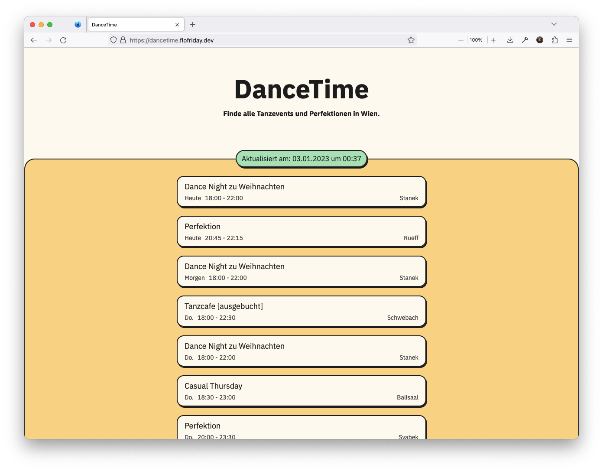
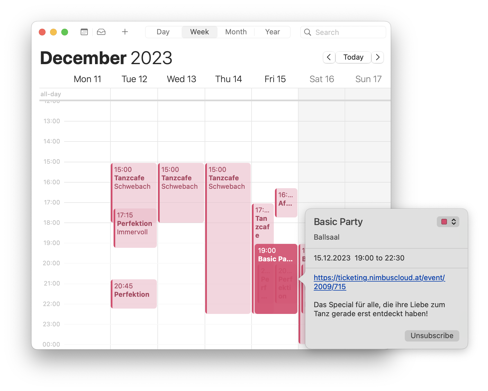

You might not expect this from someone who otherwise only publicly talks about programming, compilers, garbage collectors or geeks out about [beautifully written PR's for the CPython interpreter](https://github.com/python/cpython/pull/113465), but I quite like ballroom dancing.

The hoody from the last hackathon might need be swapped for a suite, smoking or even a tux and the scene is no longer a office with fancy standing desks and stale coffee but got upgraded for an opera house which might have been rebuilt after it got destroyed during the second world war and meticulously [rebuilt exactly as it was before](https://www.wiener-staatsoper.at/en/about-us/the-opera-house/history-architecture/history/). Though at the end of the day you still get to geek out with like minded people, maybe not about [how to optimize a mandelbrot renderer](/posts/the-fastest-mandelbrot-renderer-on-the-playdate/) but more about how that last tango was so beautiful dramatic it was almost as if your feet danced on their own.

And while I enjoy dancing, about two years ago a friend of mine, let's call him Paul, because that is his name, got really into it, often hitting multiple _perfections_ (additional trainings at dance-schools) per week. However, once I had the chaotic pleasure of observing him how he found the _right_ perfection which involved checking 4 or 5 dance-school websites, keeping all the information in his head and switching tabs as if his life depended on it.

So obviously this had a simple solution, just write a tool that collects all the events and displays them all in one place. 

## The simplest solution

While I initially played with the idea of writing an Android App to finally try out [Jetpack Compose](https://developer.android.com/compose), I eventually settled on the much more pragmatic solution of a website.
For once, websites are easier to update, but more importantly it's much easier for people to check them out (especially if they use an iPhone).

Since the website is only used to display data and link to other pages, the frontend is incredibly simple and static (no JS required), so there is nothing special to talk about. Because back then neobrutalism was all the rage I also tried to replicate that look and improve my tailwind skills which definitely paid of for future projects.

Gathering the data from the dance-schools also seemed easy enough as most of them render the pages on the server so just parsing the HTML was good enough, and some even used a JSON API's without authentication which I could directly call.
However, at some point I discovered that, one webpage takes about ~5sec to load (yes really) and another didn't have all the event details on one page and so you need to do `n + 1` request to get all the information.

That needs some kind of caching as waiting 5+ seconds is just too much, but I don't expect many users so the cache would often be invalid. Another idea was to load the events in dynamically so that the events from the slow page get inserted later, but even with nice animations this would make scrolling quite annoying when suddenly new events appear. Could we maybe predict which dance-schools are slow to fetch and preheat the cache for them artificially?

Wait, what are we building here? Most dance-schools only ever update their events every couple of months. So we can just write a super simple custom static site generator that produces HTML and runs every day, gathers all the events and publishes them (in the end I ended up scheduling it hourly but daily would probably also be good enough).

For some few dance-schools scraping the web seemed to unreliable and so I just 
hardcoded the information from their website into the generator. This isn't 
an ideal solution as they can get out of sync, but in practice that didn't
happen too often.

As I was at it I also added JSON and CSV exports just for fun, I don't think anyone uses them but now it would be super easy in the future to write a custom Android App for it.

## Publishing and the best contribution

Hosting the tool is basically free as I already have a $5 server I rent for my blog and some other tools and so I just set up a systemd service with a timer that starts the script every hour.

Also, CI/CD is a godsent. The initial setup can be a pain, often with many commits called something like "Fix CI/CD" followed by "Fix CI/CD again", but once it works, deploying to production is as easy as `git push`. In the past two years I never had to tweak it and allows me to quickly fix something, even from public transport with the GitHub app.

After it was deployed I showed it to Paul and he was obviously excited and in a long Discord call we finished many rough edges and then he added a feature I didn't expect, would be the best way to use the site: the calendar integration.

Having the events as a subscribable calendar in your calendar app just feels so *right*. Most of the time I have the dance events hidden but when I want to find the right event I enable them, already see which events clash with other events in my calendar and copy the perfection I want to my personal calendar before I disable the events again.

It works so seamlessly that I'm almost embarrassed I didn't come up with it myself.

Finally we posted the app to some dance specific group chats we're in and every now and then when someone asks for great perfections I show them the tool.

## Two years in production

In production _dancetime_ is an absolute delight. Every couple of months or so I need to update the code for one of the dance-schools because either the hard coded events are out of sync or because a website that we scrape has an update. Focusing on the simplest possible solution really paid of.

Over the years, friends told their friends who told their friends and now we have about 70 unique users every month. That isn't a lot by any means and there are many more dancers in Vienna, but I'm just happy I can provide a useful tool to a community I care about.

Eventually you will find yourself again at such an event, talking to someone new at the bar, while a [rumba to fall in love to](https://open.spotify.com/track/6Tz6bOXpctkXk0ZRZlAAo2?si=6cfa351480af4c81) plays in the background. As you talk about the best dance-schools in the city, they suddenly pull out their phone to show you a website that collects many events, which unbeknownst to them has an incredible simple architecture.

<!-- And then you find will yourself again at such an event taking to someone new at the bar about the best dance-schools in the city, as a beautiful rumba plays in the background. Suddenly they will pull out their phone to show you a website, which collects many perfections and has an incredible simple architecture. -->

[Live Website 💃](https://dancetime.flofriday.dev)